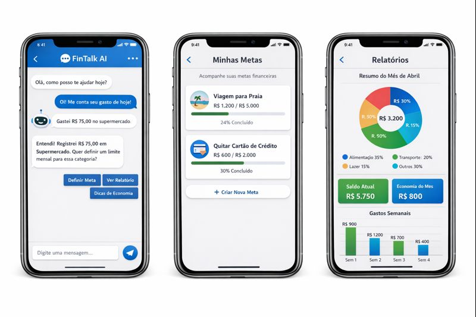

# 💸 FinTalk AI — App de Organização de Finanças Pessoais por Conversa

> Projeto conceitual desenvolvido com a abordagem **Vibe Coding**, utilizando IA como parceira criativa para idealizar, estruturar e validar um aplicativo de organização financeira baseado em conversas naturais.

---

## 📌 Visão Geral

O **FinTalk AI** é um aplicativo conceitual de organização de finanças pessoais que permite ao usuário controlar gastos, definir metas e receber orientações financeiras por meio de **conversas em linguagem natural**, sem a necessidade de formulários complexos ou planilhas.

A proposta é reduzir fricção, aumentar adesão e tornar o controle financeiro algo simples, acessível e contínuo.

---

## 🎯 Problema

Muitas pessoas abandonam o controle financeiro porque:

- Os aplicativos exigem muita entrada manual  
- A criação de orçamentos é cansativa  
- Falta personalização  
- A experiência é pouco intuitiva  

---

## 💡 Solução

Criar um aplicativo que funcione como um **consultor financeiro conversacional**, capaz de:

- Registrar gastos via chat  
- Classificar automaticamente despesas  
- Criar metas personalizadas  
- Gerar relatórios simples  
- Enviar dicas automáticas de economia  

Tudo isso usando **agentes de IA**, guiados por prompts bem estruturados.

---

## 🧠 Metodologia Utilizada

- Vibe Coding  
- MVP (Produto Mínimo Viável)  
- Prompt Engineering  
- IA como parceira criativa  

Ferramentas exploradas:

- Copilot Web  
- Lovable  

---

## 📄 PRD Final (Prompt Utilizado)

```txt
# Contexto
Quero criar um aplicativo de Organização de Finanças Pessoais que funcione por meio de conversas com o usuário.
A ideia é facilitar o controle financeiro de forma simples e natural, sem formulários manuais ou planilhas complexas.

# Problema
Muitas pessoas desistem de controlar seus gastos porque os apps atuais exigem muita entrada manual e pouca personalização.
Quero resolver isso com uma experiência de conversa e recomendações automáticas de economia.

# Público-Alvo
Pessoas que querem começar a organizar suas finanças de forma prática e sem complicação, principalmente iniciantes.

# Funcionalidades-Chave
1. Registrar gastos via chat em linguagem natural.
2. Classificar automaticamente as transações.
3. Definir e acompanhar metas financeiras.
4. Receber dicas de economia do “Agente Financeiro”.
5. Visualizar relatórios simples e personalizados.

# Entregável da IA
Gerar um plano de MVP com as principais telas, recursos necessários e um esboço de validação inicial.
Usar tom educativo e linguagem acessível, em português.
```

## 🤖 Agente Financeiro

**Nome:** FinBot  
**Personalidade:** amigável, claro, motivador e sem julgamentos.  
**Função:** atuar como consultor financeiro pessoal.

**Exemplo:**

> "Perfeito! Registrei um gasto de R$120 em Alimentação. Quer definir um limite mensal para essa categoria?"

---

## 📱 Fluxo Conceitual de Telas

- Tela de Boas-vindas  
- Onboarding rápido  
- Tela de Chat (principal)  
- Tela de Metas  
- Tela de Relatórios  

---

## 🚀 Funcionalidades do MVP

- Registro de gastos via conversa  
- Classificação automática  
- Criação de metas  
- Alertas inteligentes  
- Relatórios mensais simples  

---

## 🧪 Plano de Validação

- Usuários conseguem registrar gastos sem ajuda?  
- Usuários entendem seus relatórios?  
- Usuários voltam a usar após 7 dias?  

**Indicadores:**

- Taxa de retenção  
- Número de interações por usuário  
- Metas criadas  

---

## 📸 Demonstração




---

## 📚 Aprendizados

- Bons prompts geram soluções melhores que códigos isolados  
- Clareza de intenção é mais importante que perfeição técnica  
- IA funciona melhor como parceira do que como executora cega  

---

## 🏁 Conclusão

Este projeto demonstrou como é possível idealizar produtos digitais completos utilizando **Vibe Coding**, mesmo sem escrever código, focando em lógica, estrutura e experiência do usuário.

---

## 👨‍💻 Autor

Kleber Rafael

